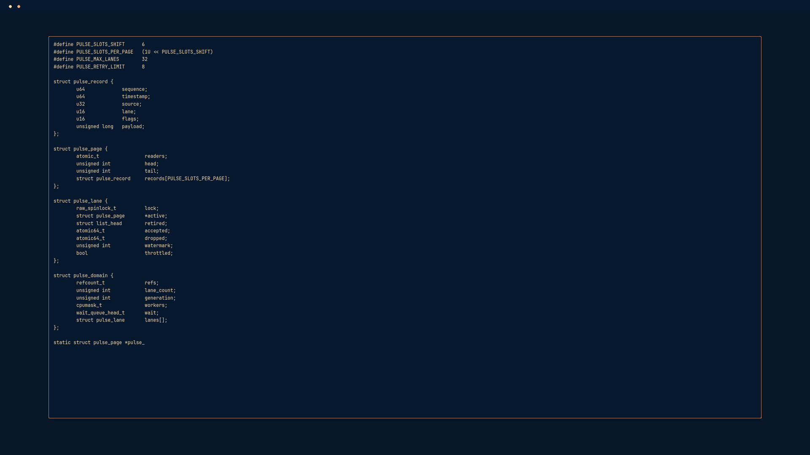

# Hacker Typer for Omarchy

Turn any keyboard into an implausibly productive terminal. Hacker Typer is a playful, native Omarchy shell plugin: choose from 14 languages in the bar, launch a large terminal styled by your active theme, and type anything to reveal convincing code.

The interface follows your active Omarchy colors and monospace font, with Hyprland's active border and Omarchy's corner rounding. It runs entirely inside `omarchy-shell`—no WebView, network access, external process execution, or system changes.



## Install

```bash
omarchy plugin add https://github.com/codefriendly/omarchy-hackertyper.git --enable
```

## Requirements

Hacker Typer requires an Omarchy release with Quattro plugin support. It has no additional runtime dependencies.

Click the `>_` icon in the bar, choose a language, and select **Launch**.

## Controls

- **Typing** reveals the next characters.
- **Backspace** rewinds.
- Press **Alt three times** for `ACCESS GRANTED`.
- Press **Caps Lock three times** for `ACCESS DENIED`.
- **Escape** dismisses an access message, then exits the overlay.

You can also launch the selected source from the command line:

```bash
omarchy-shell codefriendly.hackertyper launch "" ""
```

## Sources

Bundled languages: **C, C++, C#, Java, TypeScript, Python, Go, Rust, Ruby, PHP, Bash, SQL, Lua, and QML**.

All bundled language samples are project-authored and MIT-licensed. The QML option displays this plugin's own `HackerTyper.qml`; no source is copied from Linux or the original Hacker Typer repository.

## Privacy and safety

Hacker Typer is visual theater only. Displayed source is read as text and never executed. The plugin does not spawn external processes, contact the network, write files, or change user or system configuration.

## Remove

```bash
omarchy plugin remove codefriendly.hackertyper
```

## Development

```bash
omarchy plugin validate .
node tests/hackertyper.test.js
QML_IMPORT_PATH=/usr/share/omarchy/shell qmllint \
  BarWidget.qml Panel.qml Service.qml HackerTyper.qml
```

## Credits

Inspired by [Hacker Typer](https://github.com/duiker101/Hacker-Typer) by Simone Masiero. This plugin is an independent native-QML reimplementation and does not embed or copy the original website or its bundled source text.

MIT licensed. See [LICENSE](LICENSE) and [THIRD_PARTY_NOTICES.md](THIRD_PARTY_NOTICES.md).
